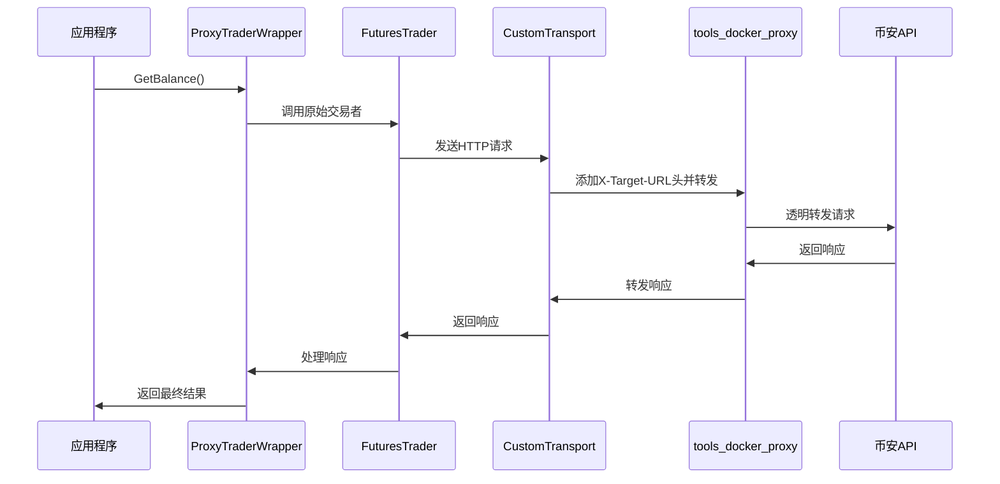

# USE_BINANCE_PROXY=true 代码层面执行流程分析报告

## 📋 报告概述

本报告详细分析了当环境变量 `USE_BINANCE_PROXY=true` 时，系统从代码层面的完整执行流程，包含具体的文件位置、函数调用链路和数据流向。

## 🎯 执行流程总览

```
环境变量检查 → 交易者创建 → 自定义传输层 → API调用 → 代理服务转发 → 响应返回
```

## 🔍 详细执行步骤

### 步骤1：环境变量检查
**文件位置**: `trader/auto_trader.go` (第390行)
**函数**: `NewAutoTrader()`

```go
// 检查全局代理开关
useProxyGlobal := os.Getenv("USE_BINANCE_PROXY") == "true"
```

**执行逻辑**:
- 读取环境变量 `USE_BINANCE_PROXY`
- 判断值是否为 `"true"`
- 决定后续的执行路径（代理模式或直连模式）

### 步骤2：确定代理URL配置
**文件位置**: `trader/auto_trader.go` (第397-400行)

```go
if useProxyGlobal {
    // 获取代理服务URL
    proxyURL := os.Getenv("BINANCE_PROXY_URL")
    if proxyURL == "" {
        proxyURL = "http://localhost:8081" // 默认代理URL
    }
    endpoint = proxyURL
```

**配置优先级**:
1. 环境变量 `BINANCE_PROXY_URL`
2. 默认值 `http://localhost:8081`

### 步骤3：确定目标端点
**文件位置**: `trader/auto_trader.go` (第403-413行)

```go
// 真正的目标端点应该是自定义API URL或默认的交易所URL
targetEndpoint = getBinanceCustomEndpointForAutoTrader(&config)
if targetEndpoint == "" {
    if config.ExchangeTestnet {
        targetEndpoint = "https://testnet.binancefuture.com"
    } else {
        targetEndpoint = "https://fapi.binance.com"
    }
}
```

**目标端点选择逻辑**:
- 优先使用配置中的自定义API URL
- 测试网模式: `https://testnet.binancefuture.com`
- 主网模式: `https://fapi.binance.com`

### 步骤4：创建代理模式交易者实例
**文件位置**: `trader/auto_trader.go` (第416行)
**调用函数**: `NewFuturesTraderViaProxy()`

```go
// 在代理模式下，创建一个连接到代理服务的交易者实例
originalTrader := NewFuturesTraderViaProxy(
    config.BinanceAPIKey, 
    config.BinanceSecretKey, 
    userID, 
    endpoint,           // 代理URL (http://localhost:8081)
    targetEndpoint      // 真实目标URL
)
```

### 步骤5：期货交易者初始化
**文件位置**: `trader/binance_futures.go` (第155-210行)
**函数**: `NewFuturesTraderViaProxy()`

```go
func NewFuturesTraderViaProxy(apiKey, secretKey, userId, proxyURL, targetEndpoint string) *FuturesTrader {
    var client *futures.Client
    // 连接到代理URL
    client = futures.NewClient(apiKey, secretKey)
    client.BaseURL = proxyURL // 连接到代理服务
```

**关键配置**:
- `client.BaseURL` 设置为代理URL (`http://localhost:8081`)
- 后续所有API调用都将发送到代理服务

### 步骤6：配置自定义传输层
**文件位置**: `trader/binance_futures.go` (第177-180行)

```go
// 创建CustomTransport，将真正的目标端点传递给代理
customTransport := &CustomTransport{
    Transport:      transport,
    TargetEndpoint: targetEndpoint, // 真正的目标URL
}
```

**CustomTransport结构体**:
```go
type CustomTransport struct {
    Transport      http.RoundTripper
    TargetEndpoint string // 真正的目标端点
}
```

### 步骤7：设置HTTP客户端
**文件位置**: `trader/binance_futures.go` (第182-190行)

```go
if client.HTTPClient == nil {
    client.HTTPClient = &http.Client{
        Transport: customTransport,
        Timeout:   120 * time.Second,
    }
} else {
    client.HTTPClient.Transport = customTransport
    client.HTTPClient.Timeout = 120 * time.Second
}
```

**配置说明**:
- 使用自定义传输层 `CustomTransport`
- 设置120秒超时时间
- 通过传输层传递目标端点信息

### 步骤8：创建代理交易者包装器
**文件位置**: `trader/auto_trader.go` (第417行)
**函数**: `NewProxyTraderWrapperWithAuth()`

```go
trader = NewProxyTraderWrapperWithAuth(
    originalTrader, 
    "proxy", 
    proxyURL,           // http://localhost:8081
    config.BinanceAPIKey, 
    config.BinanceSecretKey, 
    targetEndpoint
)
```

**包装器作用**:
- 路由决策（代理模式 vs 直连模式）
- 统一API调用接口
- 根据 `dataAccessMethod` 决定调用路径

### 步骤9：API调用发起
**文件位置**: `trader/proxy_wrapper.go` (第65-75行)
**调用方法**: `GetBalance()`

```go
func (p *ProxyTraderWrapper) GetBalance() (map[string]interface{}, error) {
    if p.shouldUseProxy() {  // 检查dataAccessMethod == "proxy"
        logger.Infof("🏦 [%s] Using proxy for balance query", p.dataAccessMethod)
        // 直接调用原始交易者的方法
        return p.trader.GetBalance()
    }
    // 直连模式处理...
}
```

### 步骤10：实际API调用执行
**文件位置**: `trader/binance_futures.go` (第274行)
**函数**: `GetBalance()`

```go
account, err = t.client.NewGetAccountService().Do(ctx)
```

**调用过程**:
1. 通过 `futures.Client` 发起API请求
2. 请求被 `CustomTransport` 拦截
3. 在 `RoundTrip` 方法中添加目标URL头部

### 步骤11：自定义传输层处理
**文件位置**: `trader/binance_futures.go` (第1976-1984行)
**函数**: `RoundTrip()`

```go
func (ct *CustomTransport) RoundTrip(req *http.Request) (*http.Response, error) {
    // 如果我们正在使用代理，将真实的目标端点添加到请求头中
    // 这样代理就知道应该将请求转发到哪里
    if ct.TargetEndpoint != "" {
        req.Header.Set("X-Target-URL", ct.TargetEndpoint)  // 添加目标URL头部
    }
    return ct.Transport.RoundTrip(req)
}
```

**关键操作**:
- 在请求头中添加 `X-Target-URL` 字段
- 值为真实的目标API地址
- 不修改请求的其他内容

### 步骤12：代理服务接收请求
**文件位置**: `tools_docker_proxy/main.go` (第165-181行)
**函数**: `handleProxyRequest()`

```go
func handleProxyRequest(w http.ResponseWriter, r *http.Request) {
    logAsync("🔄 Proxy request received: %s %s", r.Method, r.URL.Path)
    
    targetURL := getTargetURL(r)  // 从X-Target-URL头部获取目标URL
    logAsync("🎯 Target URL from header: %s", targetURL)
    
    if targetURL == "" {
        http.Error(w, "Missing X-Target-URL header", http.StatusBadRequest)
        return
    }
    
    forwardRequest(w, r, targetURL)
}
```

**处理流程**:
1. 接收来自应用程序的HTTP请求
2. 从请求头提取 `X-Target-URL`
3. 验证目标URL是否存在
4. 调用转发函数

### 步骤13：请求转发到真实API
**文件位置**: `tools_docker_proxy/main.go` (第184-340行)
**函数**: `forwardRequest()`

```go
func forwardRequest(w http.ResponseWriter, r *http.Request, targetBaseURL string) {
    // 构建完整的目标URL
    targetURL := targetBaseURL + r.URL.Path
    if r.URL.RawQuery != "" {
        targetURL += "?" + r.URL.RawQuery
    }
    
    // 读取请求体
    body, err := io.ReadAll(r.Body)
    
    // 创建新的请求
    req, err := http.NewRequest(r.Method, targetURL, bytes.NewBuffer(body))
    
    // 复制请求头
    for header, values := range r.Header {
        for _, value := range values {
            req.Header.Add(header, value)
        }
    }
    
    // 移除代理使用的特殊头部
    req.Header.Del("X-Target-URL")
    
    // 发送请求到真实API
    resp, err := httpClient.Do(req)
    
    // 复制响应返回给客户端
    for header, values := range resp.Header {
        for _, value := range values {
            w.Header().Add(header, value)
        }
    }
    w.WriteHeader(resp.StatusCode)
    io.Copy(w, resp.Body)
}
```

**转发特点**:
- **纯透传**: 不修改请求内容
- **头部复制**: 保留所有原始请求头
- **循环防护**: 防止请求转发到自身
- **错误处理**: 适当的错误响应

### 步骤14：响应返回流程
**数据流向**:
```
币安API → tools_docker_proxy → CustomTransport → FuturesTrader → ProxyTraderWrapper → 应用程序
```

**响应处理**:
1. 币安API返回响应给代理服务
2. 代理服务原样转发响应
3. `CustomTransport` 返回响应给客户端
4. `FuturesTrader` 处理响应数据
5. `ProxyTraderWrapper` 返回最终结果

## 📁 关键文件清单

### 核心执行文件
1. **`trader/auto_trader.go`** - 交易者创建入口点
2. **`trader/binance_futures.go`** - 币安期货交易者实现
3. **`trader/proxy_wrapper.go`** - 代理交易者包装器
4. **`tools_docker_proxy/main.go`** - 生产环境代理服务

### 配置文件
1. **`.env`** - 环境变量配置
2. **`docker-compose.dev.yml`** - Docker部署配置

## 🔧 环境配置要求

### 必需环境变量
```bash
USE_BINANCE_PROXY=true
BINANCE_PROXY_URL=http://localhost:8081
```

### Docker服务要求
```bash
# 启动代理服务
cd tools_docker_proxy
deploy_docker.bat
# 或
docker-compose up -d --build
```

## ⚠️ 关键注意事项

### 1. 服务依赖
- 代理服务必须先于主应用启动
- 确保 `tools_docker_proxy` 容器正常运行
- 验证端口8081可用性

### 2. 网络配置
- 代理服务需要访问互联网
- 确保防火墙允许相关端口通信
- 注意本地网络环境限制

### 3. 错误排查
- 检查代理服务日志: `docker logs tools_docker_proxy`
- 验证健康检查: `curl http://localhost:8081/health`
- 确认环境变量设置正确

## 📊 性能优化特性

**tools_docker_proxy** 包含多项性能优化：
- 连接池优化（200个空闲连接）
- 并发控制（最大100个并发请求）
- 异步日志处理
- 内存池优化（32KB缓冲区复用）
- HTTP响应压缩

## 🔄 整体流程图



## 📝 总结

当 `USE_BINANCE_PROXY=true` 时，系统采用透明代理架构，通过以下关键组件协同工作：
1. **环境变量控制**: `USE_BINANCE_PROXY` 决定执行路径
2. **代理服务**: `tools_docker_proxy` 提供高性能透传服务
3. **自定义传输层**: `CustomTransport` 在请求中添加目标信息
4. **统一包装器**: `ProxyTraderWrapper` 提供路由决策

整个流程实现了完全透明的代理转发，对上层应用保持接口一致性，同时解决了网络访问限制问题。