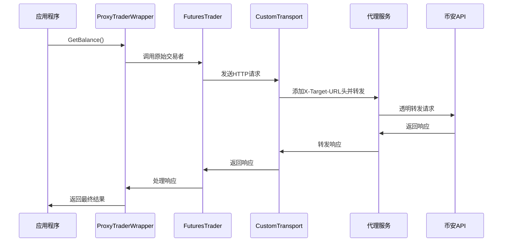

# USE_BINANCE_PROXY=true 执行流程详解

## ⚠️ 重要说明

**系统实际使用的是 `tools_docker_proxy` 服务**，而不是文档中可能提到的 `api/binance_proxy`。`tools_docker_proxy` 是生产环境优化的代理服务，具有更好的性能和稳定性。

- **实际代理服务**: `tools_docker_proxy` (Docker容器，端口8081)
- **已弃用服务**: `api/binance_proxy` (内置代理，不再推荐)
- **概念验证**: `nofx-docker-proxy` (独立代理，仅作参考)

## 📋 概述

当 `USE_BINANCE_PROXY=true` 时，系统采用代理模式架构，所有币安API请求都会通过本地代理服务转发，以绕过网络限制或监管要求。

## 🏗️ 整体架构流程

```
[应用程序] → [ProxyTraderWrapper] → [FuturesTrader(连接到代理)] → [代理服务] → [币安API]
     ↓              ↓                        ↓                    ↓              ↓
   API调用    路由决策(代理/直连)        HTTP请求(带X-Target-URL)   透明转发      实际API响应
```

## 🔧 配置文件位置

### 1. 环境变量配置
**文件**: `.env`
```bash
# 启用代理模式
USE_BINANCE_PROXY=true

# 代理服务地址
BINANCE_PROXY_URL=http://localhost:8081

# 代理服务端口(可选)
BINANCE_PROXY_PORT=8081
```

### 2. 代理服务配置
**文件**: `api/binance_proxy/config.go`
- 端口配置
- 默认目标API URL
- 调试模式设置

## 🚀 启动流程

### 1. 启动代理服务
**文件**: `tools_docker_proxy/main.go` (实际使用的服务)
```bash
# 启动命令
cd tools_docker_proxy
deploy_docker.bat

# 或使用Docker Compose
docker-compose up -d --build
```

**⚠️ 注意**: 系统实际使用的是 `tools_docker_proxy` 服务，而不是 `api/binance_proxy`。`tools_docker_proxy` 是生产环境优化的代理服务，具有更好的性能和稳定性。

**执行过程**:
1. 加载高性能配置
2. 创建优化的HTTP路由器
3. 注册通用路由处理器
4. 启动HTTP服务器监听8081端口
5. 提供健康检查端点 `/health`

### 2. 启动主应用
**文件**: `main.go`
```bash
go run main.go
```

## 🔄 核心执行流程

### 第一阶段：交易者创建

#### 1. 自动交易创建入口
**文件**: `trader/auto_trader.go`
**函数**: `NewAutoTrader()`

**⚠️ 重要提醒**: 系统目前使用的是 `tools_docker_proxy` 容器，监听在 `localhost:8081` 端口。实际调用的是生产环境的代理服务，而不是 `api/binance_proxy`。

**执行流程**:
```go
// 检查全局代理开关
useProxyGlobal := os.Getenv("USE_BINANCE_PROXY") == "true"

if useProxyGlobal {
    // 代理模式 - 实际连接到 tools_docker_proxy 容器
    proxyURL := os.Getenv("BINANCE_PROXY_URL")  // http://localhost:8081 (tools_docker_proxy服务)
    endpoint = proxyURL
    
    // 确定真实目标端点
    targetEndpoint = getBinanceCustomEndpointForAutoTrader(&config)
    if targetEndpoint == "" {
        if config.ExchangeTestnet {
            targetEndpoint = "https://testnet.binancefuture.com"
        } else {
            targetEndpoint = "https://fapi.binance.com"
        }
    }
    
    // 创建代理模式交易者 - 连接到 tools_docker_proxy
    originalTrader := NewFuturesTraderViaProxy(
        config.BinanceAPIKey, 
        config.BinanceSecretKey, 
        userID, 
        endpoint,           // http://localhost:8081 (tools_docker_proxy)
        targetEndpoint      // 真实目标URL
    )
    
    // 包装为代理交易者
    trader = NewProxyTraderWrapperWithAuth(
        originalTrader, 
        "proxy", 
        proxyURL,           // http://localhost:8081 (tools_docker_proxy)
        config.BinanceAPIKey, 
        config.BinanceSecretKey, 
        targetEndpoint
    )
} else {
    // 直连模式
    endpoint = getBinanceCustomEndpointForAutoTrader(&config)
    originalTrader := NewFuturesTrader(
        config.BinanceAPIKey, 
        config.BinanceSecretKey, 
        userID, 
        endpoint
    )
    trader = NewProxyTraderWrapperWithAuth(
        originalTrader, 
        "native", 
        "", 
        config.BinanceAPIKey, 
        config.BinanceSecretKey, 
        endpoint
    )
}
```

#### 2. 期货交易者创建
**文件**: `trader/binance_futures.go`
**函数**: `NewFuturesTraderViaProxy()`

**执行流程**:
```go
// 连接到代理URL
client = futures.NewClient(apiKey, secretKey)
client.BaseURL = proxyURL  // http://localhost:8081

// 创建自定义传输层
transport := &http.Transport{
    // 网络配置...
}

// 创建CustomTransport包装器
customTransport := &CustomTransport{
    Transport:      transport,
    TargetEndpoint: targetEndpoint,  // 真实的币安API URL
}

// 设置HTTP客户端
client.HTTPClient = &http.Client{
    Transport: customTransport,
    Timeout:   120 * time.Second,
}
```

#### 3. 自定义传输层
**文件**: `trader/binance_futures.go`
**结构体**: `CustomTransport`

**执行流程**:
```go
func (ct *CustomTransport) RoundTrip(req *http.Request) (*http.Response, error) {
    // 添加目标URL到请求头
    if ct.TargetEndpoint != "" {
        req.Header.Set("X-Target-URL", ct.TargetEndpoint)
    }
    // 执行实际的HTTP请求
    return ct.Transport.RoundTrip(req)
}
```

### 第二阶段：API调用执行

#### 1. 代理交易者包装器
**文件**: `trader/proxy_wrapper.go`
**结构体**: `ProxyTraderWrapper`

**执行流程**:
```go
// 所有API方法都会经过这个包装器
func (p *ProxyTraderWrapper) GetBalance() (map[string]interface{}, error) {
    if p.shouldUseProxy() {  // 检查dataAccessMethod == "proxy"
        logger.Infof("🏦 [proxy] Using proxy for balance query")
        // 直接调用原始交易者的方法
        return p.trader.GetBalance()
    }
    // 直连模式处理...
}
```

#### 2. 原始期货交易者调用
**文件**: `trader/binance_futures.go`
**函数**: `GetBalance()`

**执行流程**:
```go
func (t *FuturesTrader) GetBalance() (map[string]interface{}, error) {
    // 缓存检查...
    
    // 调用币安API
    ctx, cancel := context.WithTimeout(context.Background(), 20*time.Second)
    account, err := t.client.NewGetAccountService().Do(ctx)
    cancel()
    
    // 处理响应...
    return balanceInfo, nil
}
```

### 第三阶段：代理服务处理

#### 1. 代理服务入口
**文件**: `api/binance_proxy/main.go`
**函数**: `main()`

**执行流程**:
```go
// 创建路由器
r := mux.NewRouter()

// 注册路由处理器
r.HandleFunc("/fapi/v2/balance", handleBalance).Methods("GET")
r.HandleFunc("/fapi/v2/account", handleAccount).Methods("GET")
// ... 其他路由

// 启动服务器
server.ListenAndServe()
```

#### 2. 请求处理函数
**文件**: `api/binance_proxy/service.go`
**函数**: `handleBalance()`, `handleAccount()` 等

**执行流程**:
```go
func handleBalance(w http.ResponseWriter, r *http.Request) {
    // 从请求头获取目标API URL
    targetURL := getTargetAPIURL(r)  // X-Target-URL头
    
    if targetURL == "" {
        http.Error(w, "Missing X-Custom-API-URL header", http.StatusBadRequest)
        return
    }
    
    // 转发请求到目标URL
    proxyRequest(w, r, targetURL)
}
```

#### 3. 代理请求转发
**文件**: `api/binance_proxy/service.go`
**函数**: `proxyRequest()`

**执行流程**:
```go
func proxyRequest(w http.ResponseWriter, r *http.Request, targetBaseURL string) {
    // 构建完整的目标URL
    targetURL := targetBaseURL + r.URL.Path
    if r.URL.RawQuery != "" {
        targetURL += "?" + r.URL.RawQuery
    }
    
    // 读取请求体
    body, err := io.ReadAll(r.Body)
    
    // 创建新的请求
    req, err := http.NewRequest(r.Method, targetURL, bytes.NewBuffer(body))
    
    // 复制请求头
    for header, values := range r.Header {
        for _, value := range values {
            req.Header.Add(header, value)
        }
    }
    
    // 设置必要头部
    req.Header.Set("User-Agent", "NOFX-Binance-Proxy/1.0")
    
    // 发送请求到币安API
    client := &http.Client{}
    resp, err := client.Do(req)
    
    // 复制响应头和响应体
    for header, values := range resp.Header {
        for _, value := range values {
            w.Header().Add(header, value)
        }
    }
    w.WriteHeader(resp.StatusCode)
    io.Copy(w, resp.Body)
}
```

## 📁 关键文件列表

### 核心组件文件
1. **`trader/proxy_wrapper.go`** - 代理交易者包装器
2. **`trader/binance_futures.go`** - 币安期货交易者实现
3. **`trader/auto_trader.go`** - 自动交易者创建入口
4. **`tools_docker_proxy/main.go`** - 生产环境代理服务主程序 ⭐(实际使用)
5. **`tools_docker_proxy/service.go`** - 代理服务处理逻辑 ⭐(实际使用)
6. **`api/server.go`** - API服务器(创建币安交易者)

### 配置文件
1. **`.env`** - 环境变量配置
2. **`tools_docker_proxy/config.go`** - 代理服务配置 ⭐(实际使用)

### ⚠️ 已弃用组件(仅供历史参考)
- **`api/binance_proxy/`** - 原始内置代理(已弃用)
- **`nofx-docker-proxy/`** - 概念验证代理(已弃用)

### 辅助文件
1. **`dataprovider/provider.go`** - 数据提供者接口
2. **`docs/architecture/proxy-integration.md`** - 代理集成架构文档

## 🔄 数据流向示例

### 余额查询示例



## ⚠️ 注意事项

1. **代理服务必须先启动** - 在启动主应用前需要确保代理服务运行在指定端口
2. **网络配置** - 代理服务需要能够访问币安API
3. **安全性** - API密钥在网络传输中需要注意保护
4. **错误处理** - 需要处理代理服务不可用的情况
5. **性能影响** - 额外的网络跳转可能会增加延迟

## 🛠️ 故障排除

### 常见问题检查点:

1. **环境变量配置**
   ```bash
   echo $USE_BINANCE_PROXY
   echo $BINANCE_PROXY_URL
   ```

2. **代理服务状态** (实际检查 `tools_docker_proxy`)
   ```bash
   # 检查容器运行状态
   docker ps | grep tools_docker_proxy
   
   # 检查健康状态
   curl http://localhost:8081/health
   
   # 查看容器日志
   docker logs tools_docker_proxy
   ```

3. **网络连接测试**
   ```bash
   # 测试代理服务连通性
   curl -H "X-Custom-API-URL: https://fapi.binance.com" http://localhost:8081/fapi/v1/time
   ```

4. **日志监控**
   - 查看 `tools_docker_proxy` 容器日志
   - 查看主应用日志
   - 检查网络错误信息

## 📊 性能监控

### 关键监控指标:
- 代理服务响应时间
- API调用成功率
- 网络延迟
- 错误率统计
- 缓存命中率

这份文档详细描述了当 `USE_BINANCE_PROXY=true` 时系统的完整执行流程，从配置到启动，从API调用到代理转发的每一个步骤。